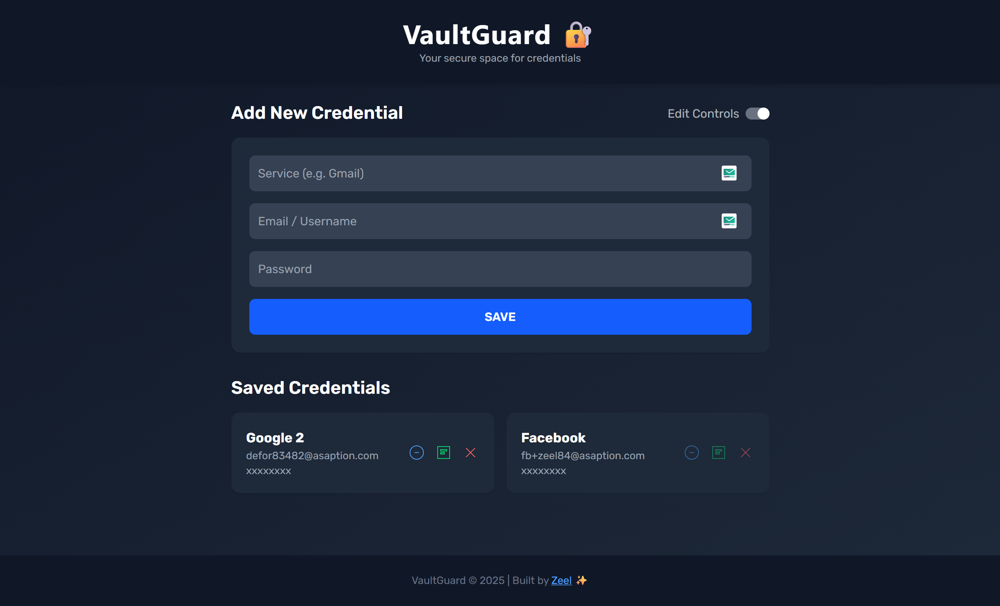
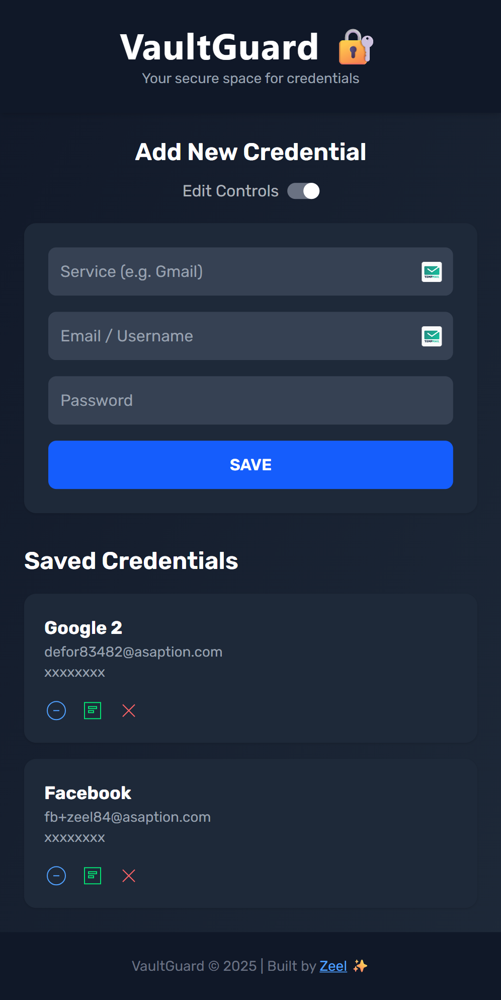
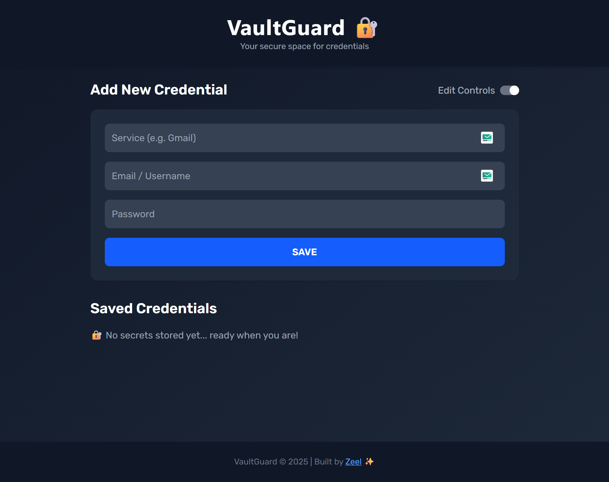
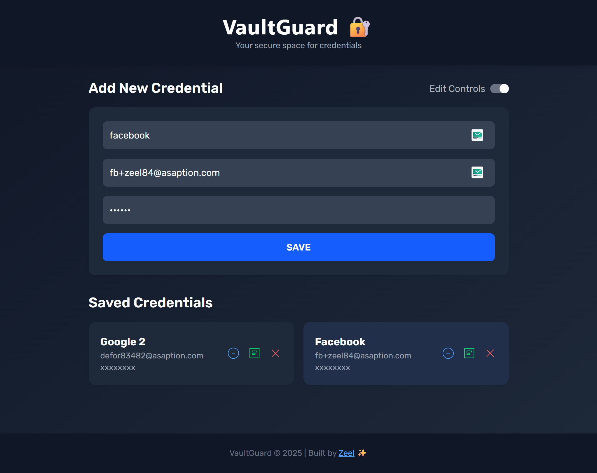

<h1 align="center">
  🔐 VaultGuard – Secure Credential Manager
</h1>

<p align="center">
  A clean and responsive <b>credential management</b> app built using <b>HTML</b>, <b>Tailwind CSS</b>, and <b>Vanilla JavaScript</b>.  
  VaultGuard allows users to securely store, view, edit, and delete credentials right in the browser, with data persisted using <b>LocalStorage</b>.
</p>

---

## 🔗 Live Demo

👉 [View on Netlify](https://vaultguard-cred-manager.netlify.app/)  
👉 [View on GitHub Pages](https://panchal-zeel.github.io/Vaultguard-Credentials-Manager/)

---

## 📸 Project Screenshots

### 💻 Desktop View


### 📱 Mobile View


### 📱 Desktop Home View (Without any credential saved)


### 📱 Credentials Edit Mode


---

## 🚀 Features

- ➕ Add new credentials with service name, username, and password
- 👀 View stored credentials in a clean, responsive table
- 🔄 **Toggle Security Mode** – enable/disable sensitive actions:
  - 🔓 **Unlocked Mode** → View passwords, edit credentials, delete credentials
  - 🔒 **Locked Mode** → All sensitive actions disabled for safety
- ✏ Edit credentials using an edit mode toggle
- 🗑 Delete credentials instantly
- 💾 Persistent storage using **LocalStorage**
- 🎨 Styled with **Tailwind CSS**
- 📱 Fully responsive design

---

## 🛠️ Tech Stack

| Tech         | Purpose                                  |
|--------------|------------------------------------------|
| HTML         | Page structure                           |
| Tailwind CSS | Styling and layout                       |
| JavaScript   | Functionality and interactivity          |
| LocalStorage | Persistent credential storage in browser |

---

## 🧪 How to Use

1. Fill in the **Service Name**, **Username**, and **Password** fields
2. Click **Add** to save the credential
3. Use **Edit** to modify stored credentials
4. Use 🗑 **Delete** to remove a credential
5. Use the **Security Mode Toggle** at the top to control actions:
   - **Unlocked Mode** → You can view passwords, edit credentials, and delete them
   - **Locked Mode** → All sensitive actions are disabled for protection
6. Data stays saved even after refreshing the page

---

## 📁 Project Structure

```
📦  VaultGuard/
├── index.html              # Main HTML file
├── vaultguard.css          # Compiled Tailwind CSS
├── logo.png                # App logo
├── vaultguard_script.js    # All JS logic
├── Project Previews/       # Project Screenshots
│ ├── vaultguard_desktop.png
│ └── vaultguard_editmode.png
│ └── vaultguard_home.png
│ └── vaultguard_mobile.png
└── .gitignore        # Files to be ignored by Git
```

## 📜 License

MIT License © 2025 Zeel Panchal

## 👨‍💻 Author

**Zeel Panchal**  
[GitHub Profile](https://github.com/Panchal-Zeel)

---

<!-- Keywords: password manager, credential manager, vaultguard, tailwind css project, javascript password storage, localstorage credential manager, responsive web app -->
